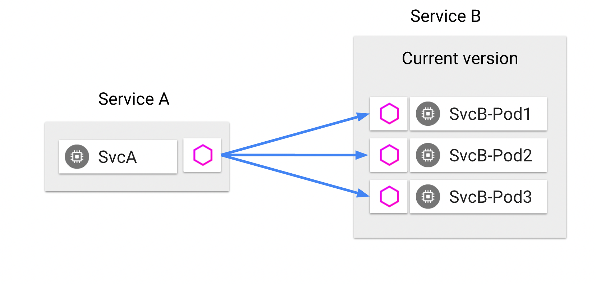

# Introduction to Istio

## Preface

In the Envoy lab, we explored two scenarios:

1. A single Envoy "cluster" with two endpoints.

    In this scenario, we observed that a request to the proxy resulted in the load-balancing of requests across the two endpoints.

1. Two Envoy clusters, together with a routing configuration to route requests from the proxy to either cluster depending on the request's path prefix:

    - Requests having the path prefix of `/one` were routed to the first cluster's `/ip` endpoint, and
    - Requests with the path prefix of `/two` were routed to the second cluster's `/user-agent` endpoint.

In this lab, you will learn how to model both scenarios in the context of Istio.

Envoy is a building block of Istio.

In Istio, Envoy proxies are configured indirectly, using a combination of:

1. Implicit information drawn from the Kubernetes environment in which services run, and
1. Istio-specific Kubernetes custom resource definitions (CRDs).

## Install Istio

Follow [these instructions](https://tetratelabs.github.io/istio-0to60/install/) to install Istio in your environment.

## Where are the Envoys?

In Istio, Envoy proxy instances are present in two distinct locations:

1. In the heart of the mesh: they are bundled as sidecar containers in the pods that run our workloads.
1. At the edge: as standalone gateways handling ingress and egress traffic in and out of the mesh.

An ingress gateway is deployed as part of the installation of Istio.  It resides in the `istio-system` namespace.  Verify this:

```shell
kubectl get deploy -n istio-system
```

To deploy Envoy as a sidecar, we will employ the convenient [automatic sidecar injection](https://istio.io/latest/docs/setup/additional-setup/sidecar-injection/#automatic-sidecar-injection), which works as follows:

1. Label the target namespace with the special label `istio-injection` with the value `enabled`:

    ```shell
    kubectl label ns default istio-injection=enabled
    ```

    Verify:

    ```shell
    kubectl get ns -Listio-injection
    ```

1. When using `kubectl` to apply a deployment, Istio employs a Kubernetes [admission controller](https://kubernetes.io/docs/reference/access-authn-authz/admission-controllers/) to augment the pod specification to bundle Envoy into a sidecar container named `istio-proxy`.

    Verify this:  observe the presence of the istio sidecar injector in your Kubernetes cluster:

    ```shell
    kubectl get mutatingwebhookconfigurations
    ```

## Turn on Envoy access logging

Turn on access logging in Envoy, by applying the following Telemtry custom resource:

!!! tldr "access-logging.yaml"
    ```yaml linenums="1"
    --8<-- "istio/access-logging.yaml"
    ```

```shell
kubectl apply -f access-logging.yaml
```

This will simplify our ability to observe http requests in the mesh.

## Scenario 1: Load-balancing across multiple endpoints

### Deploy httpbin

As in the previous lab, we use [httpbin](https://httpbin.org/) as the application under test.

Istio conveniently provides httpbin as one of its [sample applications](https://github.com/istio/istio/tree/master/samples/httpbin).

For convenience, you will find copy of the [`httpbin.yaml`](https://raw.githubusercontent.com/istio/istio/master/samples/httpbin/httpbin.yaml) Kubernetes manifest in the `artifacts` folder.

Deploy httpbin to the default namespace:
   
??? tldr "httpbin.yaml"
    ```yaml linenums="1"
    --8<-- "istio/httpbin.yaml"
    ```

```shell
kubectl apply -f httpbin.yaml
```

#### Scale httpbin

```shell
kubectl scale deploy httpbin --replicas=2
```

Having two pods will give us the two endpoints to load-balance against.

### Deploy the `sleep` client

Istio also provides a convenient [sample app named sleep](https://github.com/istio/istio/tree/master/samples/sleep).

Deploy the [sleep](https://raw.githubusercontent.com/istio/istio/master/samples/sleep/sleep.yaml) client:

??? tldr "sleep.yaml"
    ```yaml linenums="1"
    --8<-- "istio/sleep.yaml"
    ```

```shell
k apply -f sleep.yaml
```

### Challenge

Observe that all pods in the `default` namespace each have two containers:

```shell
kubectl get pod -n default
```

Can you discover the name of the sidecar container?

??? hint

    Describe any of the pods in the default namespace and study the `Containers` section.

### Observe load-balancing between the two endpoints

Requests from `sleep` are load-balanced across the two `httpbin` endpoints.



!!! note

    In the commands below, we capture the names of each of the two `httpbin` pods and of the `sleep` pod independently for clarity.

1. Tail the logs of each Envoy sidecar on the receiving end.

    In one terminal, run:

    ```shell
    HTTPBIN_POD_1=$(kubectl get pod -l app=httpbin -ojsonpath='{.items[0].metadata.name}')
    kubectl logs --follow $HTTPBIN_POD_1 -c istio-proxy
    ```

    !!! note
    
        Note above how the name of the container `istio-proxy` is used to reference the sidecar.

    In a second terminal, run:

    ```shell
    HTTPBIN_POD_2=$(kubectl get pod -l app=httpbin -ojsonpath='{.items[1].metadata.name}')
    kubectl logs --follow $HTTPBIN_POD_2 -c istio-proxy
    ```

1. Make repeated calls from the `sleep` container to the httbin service and observe which of the two `httpbin` pods receives the request.

    ```shell
    SLEEP_POD=$(kubectl get pod -l app=sleep -ojsonpath='{.items[0].metadata.name}')
    kubectl exec $SLEEP_POD -it -- curl httpbin:8000/html
    ```

### Behind the curtain

The Istio CLI, `istioctl`, provides a handy subcommand `proxy-config`, that will help us get at the configuration of the Envoy proxy in the sleep pod: its listeners, routes, clusters, and endpoints.

Capture the name of the sleep pod to a variable:

```shell
SLEEP_POD=$(kubectl get pod -l app=sleep -ojsonpath='{.items[0].metadata.name}')
```

#### Envoy's listeners configuration

Run the following command:

```shell
istioctl proxy-config listener $SLEEP_POD
```

The output displays a high-level overview of the Envoy listener configuration.
From this output we learn that Envoy has multiple listeners, listening on multiple ports.

Some listeners handle inbound requests, for example there's a health endpoint on port 15021, and a prometheus scrape endpoint on port 15090.

The listener on port 8000 (which matches the port number of the httpbin cluster IP service) is responsible for handling requests bound to the `httpbin` service.

To see the full listener section of the Envoy configuration for port 8000, run:

```shell
istioctl proxy-config listener $SLEEP_POD --port 8000 -o yaml
```

The output is voluminous (~ 200+ lines).

Note the following:

- `trafficDirection` (at the very end of the output) is set to `OUTBOUND`
- The `address` section specifies the address and port that the listener is configured for:
    ```yaml
    address:
        socketAddress:
        address: 0.0.0.0
        portValue: 8000
    ```
- The configuration contains a `filterChains` field:
    ```yaml
    filterChains:
    - filterChainMatch:
        applicationProtocols:
        ...
    ```
- The filter chain contains a filter named `envoy.filters.network.http_connection_manager`, and its list of `httpFilters` ends with the `router` filter:
    ```yaml
            httpFilters:
            - name: istio.metadata_exchange
            - ...
            - name: envoy.filters.http.router
            typedConfig:
                '@type': type.googleapis.com/envoy.extensions.filters.http.router.v3.Router
    ```

All of the above facts should match with what you learned in the [Introduction to Envoy](../envoy).

### The routes configuration

Similar to the `proxy-config listener` command, the high-level overview for routes is the following command:

```shell
istioctl proxy-config route $SLEEP_POD
```

Zero-in on the route configuration for port 8000:

```shell
istioctl proxy-config route $SLEEP_POD --name 8000 -o yaml
```

The output will show the route configuration, including this section:

```yaml
    ...
    routes:
    - decorator:
        operation: httpbin.default.svc.cluster.local:8000/*
      match:
        prefix: /
      name: default
      route:
        cluster: outbound|8000||httpbin.default.svc.cluster.local
    ...
```

..which states that calls to the httpbin service should be routed to the cluster named `outbound|8000||httpbin.default.svc.cluster.local`.

### The clusters configuration

We can view all Envoy clusters with:

```shell
istioctl proxy-config cluster $SLEEP_POD
```

And specifically look at the configuration for the httpbin cluster with:

```shell
istioctl proxy-config cluster $SLEEP_POD --fqdn httpbin.default.svc.cluster.local -o yaml
```

### The endppoints configuration

More importantly, we'd like to know what are the endpoints backing the `httpbin` cluster.

```shell
istioctl proxy-config endpoint $SLEEP_POD --cluster "outbound|8000||httpbin.default.svc.cluster.local"
```

Verify that the endpoint addresses from the output in fact match the pod IPs of the `httpbin` workloads:

```shell
kubectl get pod -l app=httpbin -o wide
```

## Scenarios 2: Two clusters with routing configuration

Scale back the `httpbin` deployment to a single replica:

```shell
kubectl scale deploy httpbin --replicas=1
```

### Deploy a second httpbin service

The following manifest is a separate deployment of `httpbin`, named httpbin-2.

??? tldr "httpbin-2.yaml"
    ```yaml linenums="1"
    --8<-- "istio/httpbin-2.yaml"
    ```

```shell
kubectl apply -f httpbin-2.yaml
```

If you recall, back in the Envoy lab, you wrote Envoy routing configuration involving path prefixes and rewrites.

In Istio, the routing configuration is exposed as a Kubernetes custom resource of kind `VirtualService`.

Study the manifest shown below:

!!! tldr "virtual-service.yaml"
    ```yaml linenums="1"
    --8<-- "istio/virtual-service.yaml"
    ```

It states: when making requests to the `httpbin` host, route the request to either the first destination (httpbin) or the second (httpbin-2), as a function of the path prefix in the request url.

Apply the manifest:

```shell
kubectl apply -f virtual-service.yaml
```

Verify that requests to `/one` are routed to the `httpbin` deployment's `/ip` endpoint, and that requests to `/two` are routed to the `httpbin-2` deployment's `/user-agent` endpoint.

1. Tail the logs of the httpbin pod's istio-proxy container:

    ```shell
    HTTPBIN_POD=$(kubectl get pod -l app=httpbin -ojsonpath='{.items[0].metadata.name}')
    kubectl logs --follow HTTPBIN_POD -c istio-proxy
    ```

1. In a separate terminal, tail the httpbin-2 pod's logs:

    ```shell
    HTTPBIN2_POD=$(kubectl get pod -l app=httpbin-2 -ojsonpath='{.items[0].metadata.name}')
    kubectl logs --follow HTTPBIN2_POD -c istio-proxy
    ```

1. Separately, make repeated calls to the `/one` endpoint from the sleep pod:

    ```shell
    SLEEP_POD=$(kubectl get pod -l app=sleep -ojsonpath='{.items[0].metadata.name}')
    kubectl exec $SLEEP_POD -it -- curl httpbin:8000/one
    ```

1. Likewise, make repeated calls to the `/two` endpoint from the sleep pod:

    ```shell
    SLEEP_POD=$(kubectl get pod -l app=sleep -ojsonpath='{.items[0].metadata.name}')
    kubectl exec $SLEEP_POD -it -- curl httpbin:8000/one
    ```

## Using an Ingress Gateway

Rather than configure routing for internal mesh clients, it's more interesting to configure an ingress gateway.

Indeed when installing Istio, an ingress gateway was provisioned alongside `istiod`.  Verify this:

```shell
kubectl get pod -n istio-system
```

Note that the gateway has a corresponding LoadBalancer type service:

```shell
kubectl get svc -n istio-system
```

Capture the gateway's external IP address:

```shell
GATEWAY_IP=$(kubectl get service istio-ingressgateway -n istio-system -ojsonpath='{.status.loadBalancer.ingress[0].ip}')
```

Visit the gateway ip address in your web browser; you should get back a "connection refused" message.

### Configure the gateway

To expose HTTP port 80, apply the following gateway manifest:

!!! tldr "gateway.yaml"
    ```yaml linenums="1"
    --8<-- "istio/gateway.yaml"
    ```

The wildcard value for the `hosts` field ensures a match if the request is made directly to the "raw" gateway IP address.

```shell
kubectl apply -f gateway.yaml
```

Try once more to access the gateway IP address.  It should no longer return "connection refused."  Instead you should get a 404 (not found).

### Bind the virtual service to the gateway

Study the following manifest:

!!! tldr "gw-virtual-service.yaml"
    ```yaml linenums="1"
    --8<-- "istio/gw-virtual-service.yaml"
    ```

Note:

1. the additional `gateways` field ensures that the virtual service binds to the ingress gateway.
1. the `hosts` field has been relaxed to match any request coming in through the load balancer.

Apply the manifest:

```shell
kubectl apply -f gw-virtual-service.yaml
```

### Test the endpoints

The raw gateway IP address will still return a 404.

However, the `/one` and `/two` endpoints should now be functional, and return the ip and user-agent responses from each httpbin deployment, respectively.

### Inspect the Gateway's Envoy configuration

1. Review the listeners configuration.

    ```shell
    istioctl proxy-config listener deploy/istio-ingressgateway.istio-system
    ```

1. Next study the routes configuration.

    ```shell
    istioctl proxy-config route deploy/istio-ingressgateway.istio-system
    ```

1. Zero-in on the routes configuration named `http.8080`

    ```shell
    istioctl proxy-config route deploy/istio-ingressgateway.istio-system --name http.8080 -o yaml
    ```

It's worthwhile taking a close look at the output.  Below I have removed some of the noise to highlight the most salient parts:

```yaml
    ...
    routes:
    - ...
      match:
        ...
        prefix: /one
      ...
      route:
        cluster: outbound|8000||httpbin.default.svc.cluster.local
        ...
        prefixRewrite: /ip
        ...
    - ...
      match:
        ...
        prefix: /two
      ...
      route:
        cluster: outbound|8000||httpbin-2.default.svc.cluster.local
        ...
        prefixRewrite: /user-agent
        ...
```

How does the above compare to the hand-written configuration from the previous lab?

## Summary

In comparison to having to configure Envoy proxies manually, Istio provides a mechanism to configure Envoy proxies with much less effort.
It draws on information from the environment: awareness of running workloads (service discovery) provides the inputs necessary to derive Envoy's clusters and listeners configurations automatically.

Istio Custom Resource Definitions complement and complete the picture by providing mechanisms to configure routing rules, authorization policies and more.

Istio goes one step further:  it dynamically reconfigures the Envoy proxies any time that services are scaled, or added to and removed from the mesh.

Istio and Envoy together provide a foundation for running microservices at scale.

In the next lab, we turn our attention to Web Assembly, a mechanism for extending and customizing the behavior of the Envoy proxies running in the mesh.